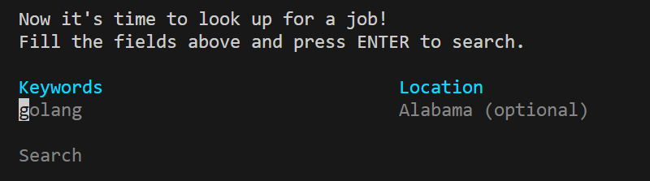
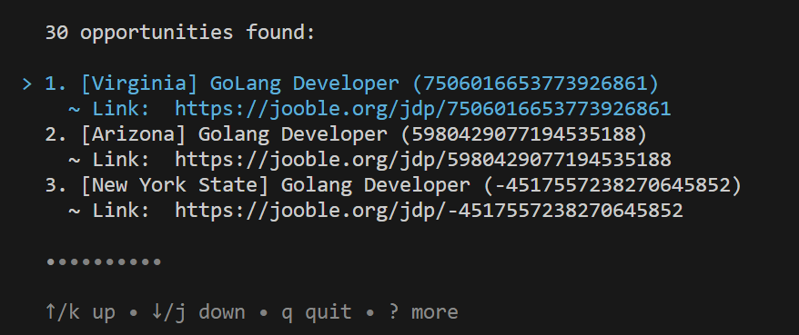

# gojooble

I developed this just to practice [charmbracelet/bubbletea](https://github.com/charmbracelet/bubbletea). I looked for a public API to do something and found [Jooble](https://jooble.org/api/about), a platform made to look for job opportunities. You actually can use this CLI to access the first page of each search (30 elements). I didn't find any documentation about Jooble's pagination schema, so I couldn't develop anything about it. Let me know if you know it!
# How to run

1. You must have [Golang v1.20+](https://go.dev/) installed on your machine. If you don't have, access its page, download and install it;
2. Clone this repository;
3. Open a terminal on the root path of the cloned repository;
4. Run `go run .` and follow the software instructions!

# Execution samples

## Home view

## Search view

## Search's Result view
